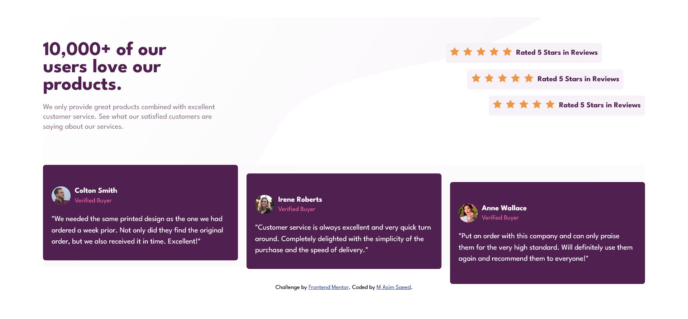

# Frontend Mentor - Social proof section solution

This is a solution to the [Social proof section challenge on Frontend Mentor](https://www.frontendmentor.io/challenges/social-proof-section-6e0qTv_bA).

## Table of contents

- [Overview](#overview)
  - [The challenge](#the-challenge)
  - [Screenshot](#screenshot)
  - [Links](#links)
- [My process](#my-process)
  - [Built with](#built-with)
  - [What I learned](#what-i-learned)

## Overview

### The challenge

Users should be able to:

- View the optimal layout for the section depending on their device's screen size

### Screenshot

### Links

- Solution URL: [Solution](https://www.frontendmentor.io/solutions/responsive-social-proof-section-using-css-5BbN9RxJ2P)
- Live Site URL: [Live Site](https://asimsaeed353.github.io/social-proof-section-master/)

## My process

### Built with

- Semantic HTML5 markup
- CSS custom properties
- Flexbox
- Mobile-first workflow

### What I learned

I learned about the approach to design layouts like this. I learned to always start with simple things and the add the complexities gradually to the design.

I tried designing layout for desktop first and then making it responsive for smaller devices, but it was not a good apporach. Then I shifted to mobile first workflow, took things simple and then made the design responsive for the large screen devices.
